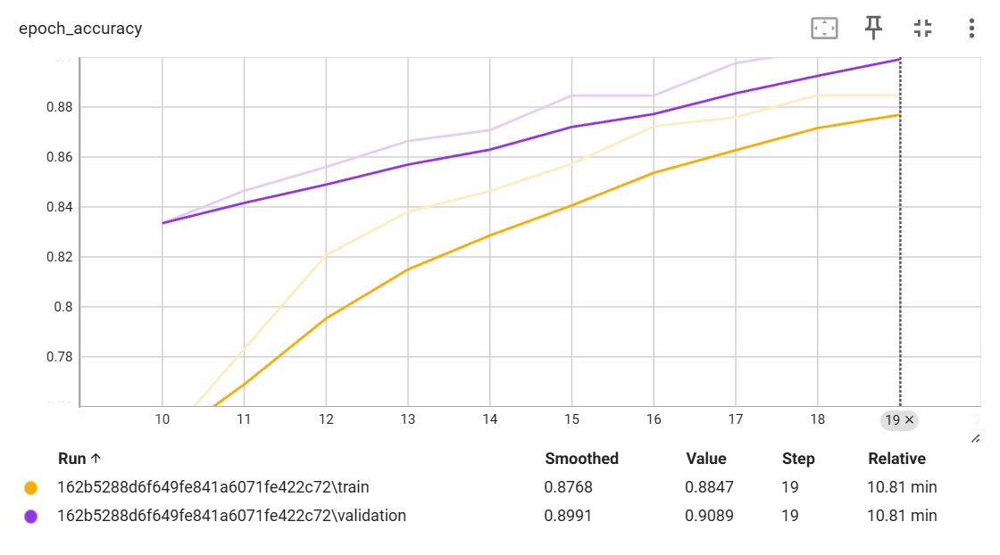
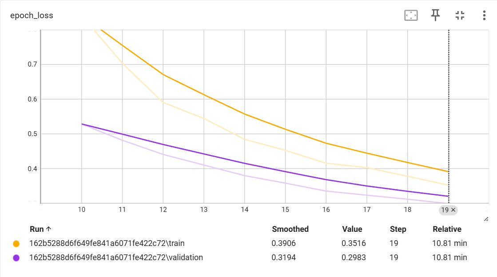

# Cat Breed Classification Using and Gen AI (Langflow)

## Project Description
This project combines Computer Vision and Generative AI to create an application that classifies cat breeds and provides detailed information through a chatbot interface. The system allows users to:

* Upload an image of a cat.
* Predict the breed using a deep learning model.
* Generate informative responses about the breed using a Generative AI chatbot built with Langflow.

## Features

* Cat breed classification using a deep learning model
* Interactive chatbot for breed-specific information
* User-friendly interface for image upload and chatbot interaction
* Real-time feedback and suggestions based on classification results

## Usage

1. Open the application.
2. Upload an image of a cat.
3. The app will predict the cat breed.
4. The chatbot will generate information about the breed.

## Model Used

1. Computer Vision Model
* Convolutional Neural Network (CNN) for image classification
* Pre-trained model MobileNetV2 for transfer learning

2. Generative AI Chatbot
* Built using Langflow
* Create information about cat breed

## Dataset
* Dataset Source: [Cat Breed](https://www.kaggle.com/datasets/ramzanlafir/cat-breed-classification-11-classes)
* Size: 
    - Number of classes:11
    - Images per Class:500
    - Total Number of images:5,499

## Langflow Integration

* Langflow is used to build the Generative AI chatbot.  
* The chatbot takes the predicted breed and generates informative text responses.  
* Langflow allows customization of chatbot responses based on classification results

## Results and Performance

1. Accurancy

2. Loss

## License
This project is licensed under the **MIT License**.